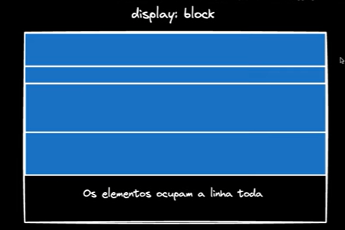
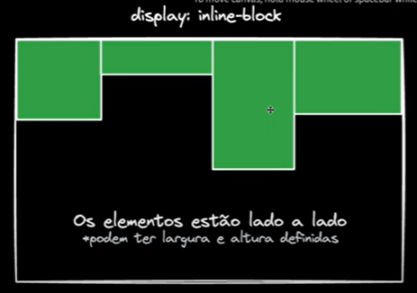
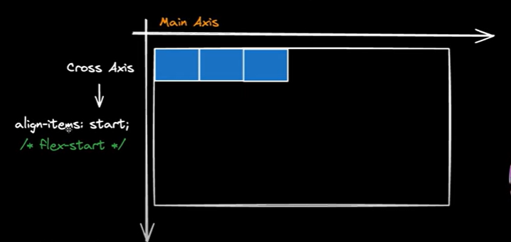
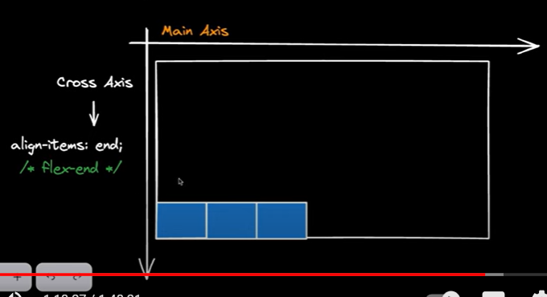
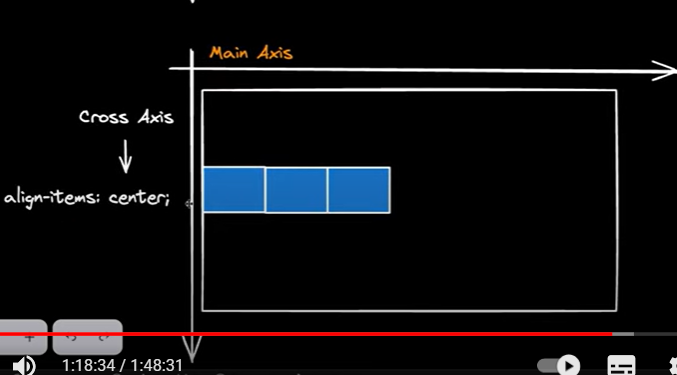

# Anotações sobre css

* Existe um conceito de calculo de peso nas tags:
- Esse cálculo é feito com base na pontuação:
  - [ ] É um ID?
  - [ ] É uma classe?
  - [ ] É um seletor normal do css?
- A relação é ID > Classe > Seletor
- Então muitas vezes, se você tem uma estilização
  que até vem depois, mas ainda assim tem menor es-
  pecificidade, ela vai ceder para a anterior mais
  específica;
- veja:
```vim
a.comprar {} 
```
- Isso significa que estou buscando uma tag 'a' com
  a classe comprar
- Essa classe acima tem peso (0,1,1) [classe + atributo]
- Agora:
```vim
a .comprar {} 
```
- Isso acima indica que estou buscando, dentro de uma
  tag 'a', um elemento qualquer que tenha classe 'comprar'

```vim
div, span {} # você quer pegar uma div ou uma span
div > span {} # quer pegar um span dentro da div
div span {} # pega qq span dentro da div mesmo tendo elementos antes
```

## Displays

- inline:


- block ('bloquear uma linha pra ele'):


- inline-block:


- agora trabalhando com o eixo cruzado (não o principal):





- Exemplo de flex:1 -> isso fará o elemento ocupar quanto 
  espaço possível for na tela;
```vim
.caixa:nth-child(2) {
    flex: 1
}
```

