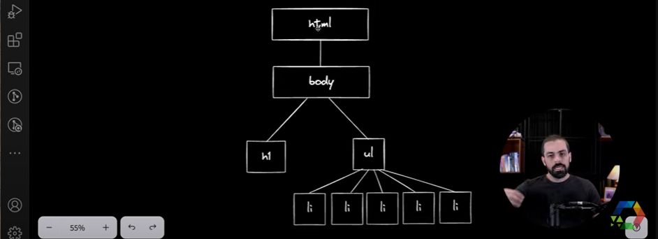

# O Essencial de HTML

* Criação de documentos;
* Hyper Text Markuo Language (linguagem de marcação, marcação por tag);
  * Hyper = vem da ideia de criar ligações entre textos;
    * Links;
* HTML tem uma DOM, e você pode vê-la assim:

  
* `div` vem de divisão, várias delas fazem os textos ficarem com a própria linha;
* `span` ou VÃO faz com que o texto interno delas fique um do lado do outro;
*  Semanticidade:
   *  aside (barra lateral);
   *  header (cabeçalho);
   *  footer...
   *  Facilita para leitores de página;
*  Textareas com possibilidade de editar o texto: richtexteditor;