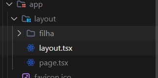

# Anotações 

- `pnpm i @tabler/icons-react` 
- `pnpm i react-loading-skeleton`
- Sempre que colocar `nomeDeNovaPasta/page.tsx` ele mapeia nova rota;
- no `globals.css`:
```vim
@layer components {
  .botao {
    @apply bg-blue-500 text-white font-bold py-2 px-4 rounded-md;
  }
}
```
- As configurações acima criam uma classe botão que pode ser usada assim:
```vim
<a className="botao"></a>
```
- veja como fica:

- o `layout.tsx` contém um layout particular para os arquivos da rota 
  `app/layout/` 
  - se você coloca um `new Date()` no `layout.tsx`, você verá que essa
    data não muda se você trafegar entre as rotas da pasta `app/layout/`;
  - se você mudar para outra rota/conjunto de pastas, aí você faz o horário
    mudar;
- tem o `template.tsx` também, o qual atualiza o `new Date()` mesmo se trocar
  entre as páginas apenas da rota `app/layout/`
- quando você usa ambos, o `layout.tsx` é mais geral, envolvendo o `template.tsx`
- componentes que rodam do lado do servidor (server components) podem acessar
  banco de dados com querys;
- configurações para busca de iamgens:
```vim
/** @type {import('next').NextConfig} */
const nextConfig = {
  images: {
    remotePatterns: [
      { protocol: 'https', hostname: 'images.unsplash.com' },
      { protocol: 'https', hostname: 'plus.unsplash.com' }
    ]
  }
}

export default nextConfig;
```
- Se precisar de buscar de outros lugares, pode colocar `hostname: **`
- quando você coloca parênteses no nome da pagina, ela **não** é traduzida em
  rota;
  - `(produtos)/celulares/` = "produtos" não vai virar rota, você vai acessar
    usando localhost:3000/celulares;
- aparentemente o padrão de nomenclatura para arquivos que tem os skeletons de
  carregamento é `loading.tsx`, eles que vão carregar os skeeltons;
- Dizemos que os arquivos da pasta `app/(paginas)/produtos/` são componentes do
  lado do server porque estão usando services (pasta `data/services/`) que são
  funções server side;
